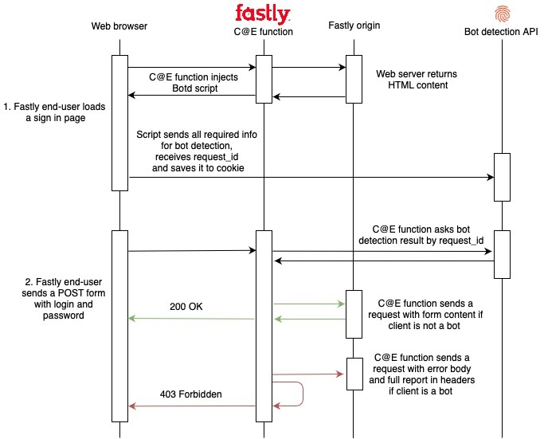

## Example app
Web application that we’re going to protect with Fastly- http://botd-integration-demo.fpjs.sh

## Flow with Fastly integration enabled
1. End-user loads an example app from https://fpjs-wasm.edgecompute.app/

2. Fastly Compute@Edge function injects bot detection agent into the page.

3. This agent makes an API call to FingerprintJS bot detection API, sending all signals, then  receives a request identifier, and saves it into `botd-request-id` cookie.

4. The end-user fills the form and submits it to the `/login` endpoint.

5. Fastly Compute@Edge function retrieves bot detection results by the request identifier (which is available in a cookie) and after receiving the results, decides what to do next.

6. If a bot is not detected, then the request will continue as is. If it was detected that the request was made by a bot, current request with bot detection results in headers will be sent to the origin, and the end-user will see this error message in the browser:
```json
{
    "error": {
        "code": 403,
        "description": "Forbidden"
    }
}
```
7. Checking the ***emulate bot*** checkbox will replace the requestId in the cookie with a known value that belongs to a bot, which will treat current request as botty and will force the bot branch of the flow.

Below is the flow diagram:



## Origin Bot Detection Headers
#### fpjs-request-id
Header with request id. Example:
`fpjs-request-id: 6080277c12b178b86f1f967d`
#### fpjs-request-status
Possible values of fpjs-request-status header = [“processed” | “in_progress” | “error”]
#### fpjs-bot-status, fpjs-browser-spoofing-status, fpjs-search-bot-status, fpjs-vm-status
Possible values of status header = [“processed” | “undefined” | “not_enough_info”]
#### fpjs-bot-prob, fpjs-browser-spoofing-prob, fpjs-search-bot-prob, fpjs-vm-prob
Possible values = [0.0 .. 1.0 | -1.0 in case of “undefined”, “not_enough_info” statuses]
#### fpjs-bot-type
Possible values = [“phantomjs”, “chrome_headless” … or empty string]
#### fpjs-search-bot-type
Possible values = [“google”, “yandex” … or empty string]
#### fpjs-vm-type
Possible values = [“vmware”, “parallels” … or empty string]
### Headers example:
```
fpjs-request-id: 6080277c12b178b86f1f967d
fpjs-request-status: processed

fpjs-bot-status: processed
fpjs-bot-prob: 0.00
fpjs-bot-type:

fpjs-browser-spoofing-status: processed
fpjs-browser-spoofing-prob: 0.00
fpjs-browser-spoofing-type: 

fpjs-search-bot-status: processed
fpjs-search-bot-prob: 0.00
fpjs-search-bot-type:

fpjs-vm-status: processed
fpjs-vm-prob: 0.00
fpjs-vm-type:
```
### Headers example, when an error occurred:
```
fpjs-request-id: 6080277c12b178b86f1f967
fpjs-request-status: error
```
